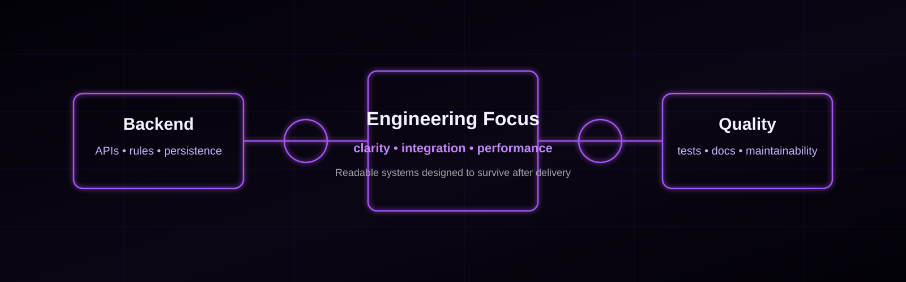

  

   

  
  
  
  

  [Português](./README.pt-BR.md)

  
  
  

## About Me

I am a Full Stack Developer focused on **Java, Spring Boot, React, and relational databases**. At BB Administradora de Consórcios, I maintained and evolved corporate systems, built internal tools and REST APIs, connected frontend, backend, and data layers, and helped automate operational processes. One documented performance investigation reduced a critical endpoint's response time from approximately 38 seconds to 5 seconds by identifying and removing processing bottlenecks.

My engineering style is pragmatic: clear boundaries, readable code, reliable APIs, careful persistence, and maintainable delivery after the first release. I work with layered architecture, SOLID, Clean Code, design patterns, unit testing, and performance investigation, with special interest in systems that combine business rules, integration, and measurable impact.

I hold a bachelor's degree in Computer Science and have experience in academic research, technical presentations, and software projects across Java, C#, Python, Go, and TypeScript ecosystems. In 2026, I completed a four-week English immersion program at ILSC Language Schools in Sydney, Australia, at an upper-intermediate level.

## Technical Arsenal

### Backend

Java • Spring Boot • C# • ASP.NET • Python • Django • Go • PHP • REST APIs

### Frontend

React • TypeScript • JavaScript • HTML • CSS

### Databases

PostgreSQL • MySQL • SQL Server • SQL • Data modeling • Query optimization

### Engineering

SOLID • Clean Code • Design Patterns • Layered Architecture • Asynchronous Programming • API Performance • Unit Testing • Systems Integration • Technical Documentation

### Tools

Git • GitHub • Docker • Linux • JUnit • Mockito • GitHub Actions

## Engineering Focus

| Backend Engineering | Full Stack Development | Software Quality |
| :--- | :--- | :--- |
| REST APIs, business rules, integrations, persistence, unit tests, and performance investigation. | End-to-end integration of React interfaces, backend services, relational databases, and supporting services. | SOLID, Clean Code, tests, documentation, layered design, and maintainable delivery. |

## Featured Projects

> I publish only code that can be shared safely. Private, employer-owned, or unauthorized code is not exposed.

### IGRIS Project

IGRIS is my Computer Science capstone ecosystem for academic resource allocation with optimization algorithms. The project combines a Java and Spring Boot backend, a React frontend, PostgreSQL, and specialized services that explore different implementation strategies across Java, Python, and Go.

**Core architecture**

- Frontend web application for academic allocation workflows.
- Backend API and persistence layer for domain rules and integrations.
- Specialized services for optimization, scheduling, simulation, and support routines.
- Academic documentation, benchmarks, and database artifacts maintained separately from the public runtime repositories.

**Stack:** Java • Spring Boot • React • TypeScript • PostgreSQL • Python • Go

### IGRIS Repositories To Pin

| Repository | Role | Stack |
| :--- | :--- | :--- |
| [igris-frontend](https://github.com/igris-project/igris-frontend) | Web interface for the IGRIS ecosystem. | TypeScript • React |
| [igris-backend](https://github.com/igris-project/igris-backend) | Main backend API for academic allocation workflows. | Java • Spring Boot |
| [igris-sunny-service](https://github.com/igris-project/igris-sunny-service) | Java microservice for specialized IGRIS processing. | Java |
| [igris-morpheus-service](https://github.com/igris-project/igris-morpheus-service) | Python microservice for analytical and optimization routines. | Python |
| [igris-rocket-service](https://github.com/igris-project/igris-rocket-service) | Go microservice for high-throughput IGRIS routines. | Go |
| [igris-gradegen-service](https://github.com/igris-project/igris-gradegen-service) | Python service supporting grade and allocation generation workflows. | Python |

### Additional IGRIS Modules

[igris-iron-service](https://github.com/igris-project/igris-iron-service) and [igris-darwin-service](https://github.com/igris-project/igris-darwin-service) extend the ecosystem with additional Python services. Private repositories hold academic documentation, benchmark material, database assets, and earlier versions that are not part of the public profile surface.

### Other Projects

#### GradeMaker

Backend project for managing academic domains such as users, institutions, components, grades, profiles, and security.

**Stack:** Java • Spring Boot • PostgreSQL • Docker

#### PGP Academy

Academic gamified programming platform developed collaboratively. My contribution covered the initial backend, logical and physical database modeling, requirements and business-rule documentation, technical planning, and presentations to the academic community.

**Stack:** C# • ASP.NET • Relational Database

#### WebPulse

Planned full-stack platform for monitoring APIs, tracking latency and uptime, detecting incidents, and sending alerts.

**Planned stack:** Java • Spring Boot • React • PostgreSQL • Docker • Redis • RabbitMQ • JUnit • Mockito • Testcontainers • GitHub Actions

## Research & Publications

### Mapeamento de Soft Skills para Carreiras Tecnológicas

Research on the role of behavioral skills in technology careers, based on questionnaire data from students, teachers, and professionals. The article discusses how communication, teamwork, adaptability, and conflict resolution complement technical skills in technology work.

**Publication:** RevistaFT
**Role:** Co-author
**Year:** 2024
**Issue:** Volume 28, Issue 138
**DOI:** `10.69849/revistaft/th10249261438`
[Read the article](https://revistaft.com.br/mapeamento-de-soft-skills-para-carreiras-tecnologicas/)

### Aplicação da Gamificação no Ensino de Programação: Desafios e Resultados na Educação Técnica

Study on gamification in technical programming education, focusing on motivation, engagement, performance, and implementation challenges. The article synthesizes educational practices involving challenges, feedback, and rewards while noting the need for teacher preparation and pedagogical alignment.

**Publication:** RevistaFT
**Role:** Co-author
**Year:** 2025
**Issue:** Volume 29, Issue 149
**DOI:** `10.69849/revistaft/cl10202508251015`
[Read the article](https://revistaft.com.br/aplicacao-da-gamificacao-no-ensino-de-programacao-desafios-e-resultados-na-educacao-tecnica/)

### Uso da Gamificação como Ferramenta Tecnológica para o Ensino de Lógica e Programação

Article on gamification as a technological tool for teaching logic and programming in technical education. It analyzes how challenges, rewards, and feedback can support motivation, performance, and practical learning.

**Publication:** RevistaFT
**Role:** Co-author
**Year:** 2025
**Issue:** Volume 29, Issue 150
**DOI:** `10.69849/revistaft/cl10202509251044`
[Read the article](https://revistaft.com.br/uso-da-gamificacao-como-ferramenta-tecnologica-para-o-ensino-de-logica-e-programacao/)

## GitHub Stats

External dynamic SVG providers were returning non-image errors during validation, so I am not embedding broken cards. Until a reliable provider is available again, use the public GitHub views below:

[Overview](https://github.com/WilkerMonky?tab=overview) • [Repositories](https://github.com/WilkerMonky?tab=repositories)

 

