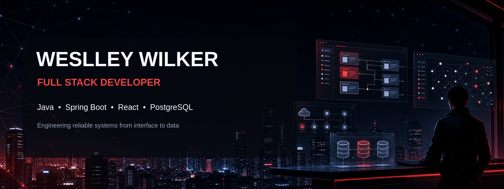
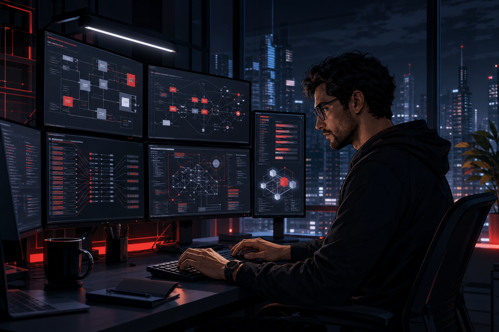
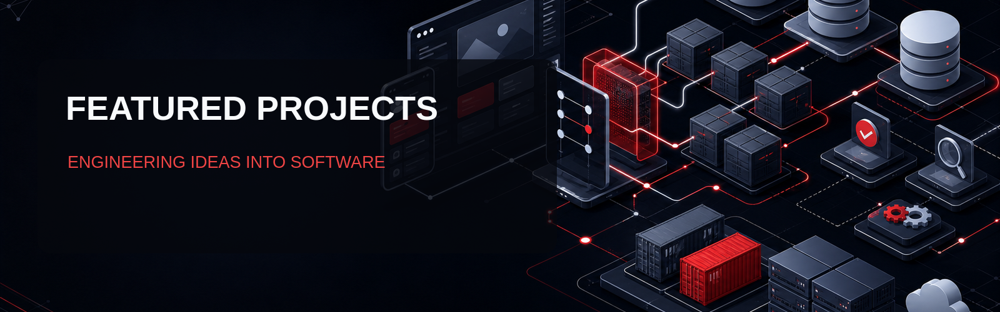
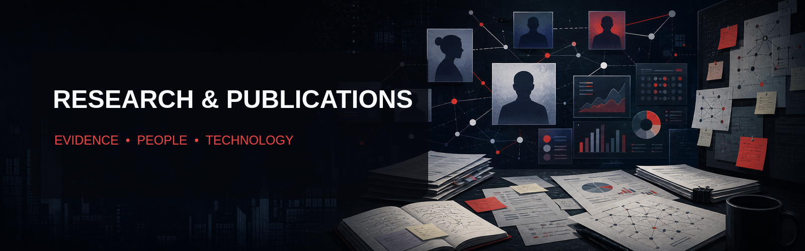

  

   

  
  
  
  

  [English](./README.md)

  
  
  

## Sobre mim

Sou Desenvolvedor Full Stack e trabalho principalmente com **Java, Spring Boot, React e bancos de dados relacionais**. Na BB Administradora de Consórcios, atuei na manutenção e evolução de sistemas corporativos, construção de ferramentas internas e APIs REST, integração entre frontend, backend e dados e automação de processos operacionais. Em uma investigação de performance documentada, reduzi o tempo de resposta de um endpoint crítico de aproximadamente 38 para 5 segundos ao identificar e eliminar gargalos de processamento.

Desenvolvo software para que permaneça legível, testável e sustentável depois da entrega. Meu trabalho utiliza arquitetura em camadas, SOLID, Clean Code, padrões de projeto, testes unitários e modelagem cuidadosa de dados. Tenho interesse especial por performance de APIs, integração entre sistemas e transformação de regras de negócio complexas em software confiável.

Sou bacharel em Ciência da Computação e tenho experiência com pesquisa acadêmica, apresentações técnicas e projetos de software nos ecossistemas Java, C#, Python e Go. Em 2026, concluí um programa de quatro semanas de imersão em inglês na ILSC Language Schools, em Sydney, Austrália, no nível intermediário superior.

## Arsenal técnico

### Backend

Java • Spring Boot • C# • ASP.NET • Python • Django • PHP • APIs REST

### Frontend

React • JavaScript • HTML • CSS

### Bancos de dados

PostgreSQL • MySQL • SQL Server • SQL • Modelagem de dados • Otimização de consultas

### Engenharia

SOLID • Clean Code • Design Patterns • Arquitetura em camadas • Programação assíncrona • Performance de APIs • Testes unitários • Integração entre sistemas

### Ferramentas

Git • GitHub • Docker • Linux • JUnit • Mockito

## Foco de engenharia

| Engenharia de Backend | Desenvolvimento Full Stack | Qualidade de Software |
| :--- | :--- | :--- |
| APIs REST, regras de negócio, integrações, persistência, testes unitários e investigação de performance. | Integração completa entre interfaces React, serviços de backend e bancos de dados relacionais. | SOLID, Clean Code, testes, documentação, arquitetura em camadas e entregas sustentáveis. |

## Projetos em destaque

> Repositórios que ainda não estão disponíveis publicamente estão identificados. Nenhum código privado, corporativo ou sem autorização será publicado.

### IGRIS

Trabalho de Conclusão de Curso em Ciência da Computação para alocação de recursos acadêmicos com algoritmos de otimização. A solução reúne um núcleo em Java e Spring Boot, frontend React, PostgreSQL e os serviços especializados Sunny (Java), Morpheus (Python) e Rocket (Go).

**Destaques**

- Aplica algoritmo genético a um problema de alocação acadêmica.
- Compara estratégias de resolução entre serviços especializados.
- Integra aplicação web, banco de dados e serviços poliglotas.

**Stack:** Java • Spring Boot • React • PostgreSQL • Python • Go

**Em breve** — o repositório e a documentação serão vinculados após a revisão e importação do código.

### Sistema de Gestão de Monitorias

Projeto acadêmico destinado à gestão de atividades de monitoria. Funcionalidades e arquitetura serão documentadas somente depois da análise do código-fonte no GitLab.

**Destaques**

- Análise de entidades e regras de negócio pendente.
- Fluxos de autenticação e perfis pendentes.
- Diagramas de arquitetura e entidades previstos para a documentação pública.

**Stack:** A verificar no código-fonte

**Em breve** — importação do GitLab pendente.

### GradeMaker

Projeto backend para gestão de domínios acadêmicos como usuários, instituições, componentes, notas, perfis e segurança.

**Destaques**

- Organização orientada aos domínios acadêmicos.
- Persistência relacional com PostgreSQL.
- Ambiente local conteinerizado a documentar com Docker.

**Stack:** Java • Spring Boot • PostgreSQL • Docker

**Em breve** — o link público será incluído após a revisão da documentação e dos exemplos.

### PGP Academy

Plataforma acadêmica e gamificada de programação desenvolvida de forma colaborativa. Minha contribuição abrangeu o backend inicial, modelagem lógica e física do banco, documentação de requisitos e regras de negócio, planejamento técnico e apresentações para a comunidade acadêmica.

**Destaques**

- Desenvolvimento inicial do backend com C# e ASP.NET.
- Modelagem lógica e física do banco de dados.
- Levantamento de requisitos e planejamento técnico colaborativo.

**Stack:** C# • ASP.NET • Banco de dados relacional

**Em breve** — a disponibilidade do repositório e a autorização de publicação precisam ser confirmadas.

### WebPulse

Uma plataforma Full Stack para monitorar APIs, acompanhar latência e disponibilidade, detectar incidentes e enviar alertas.

**Destaques**

- Monitoramento planejado de saúde, latência e disponibilidade de APIs.
- Detecção de incidentes e envio assíncrono de alertas.
- Testes automatizados e pipeline de entrega previstos desde o início.

**Stack planejada:** Java • Spring Boot • React • PostgreSQL • Docker • Redis • RabbitMQ • JUnit • Mockito • Testcontainers • GitHub Actions

**Projeto planejado** — o design e a implementação ainda não começaram.

## Pesquisa e publicações

### Soft Skills nas Carreiras de Tecnologia

Pesquisa acadêmica sobre a influência das soft skills nas carreiras de tecnologia. Minha atuação incluiu coleta e análise de dados, entrevistas com profissionais e recrutadores de tecnologia, interpretação dos resultados, produção de artigo científico e apresentação em congresso acadêmico.

**Destaques**

- Combinou análise estruturada de dados e entrevistas profissionais.
- Resultou na produção de um artigo acadêmico.
- Exige revisão de privacidade e anonimização dos participantes antes da publicação de qualquer dado.

**Repositório da publicação em breve.** O futuro repositório incluirá o PDF, metodologia, resultados, declaração de contribuição, `CITATION.cff`, licença adequada e somente dados autorizados para publicação.

## Estatísticas do GitHub

  
  

 

